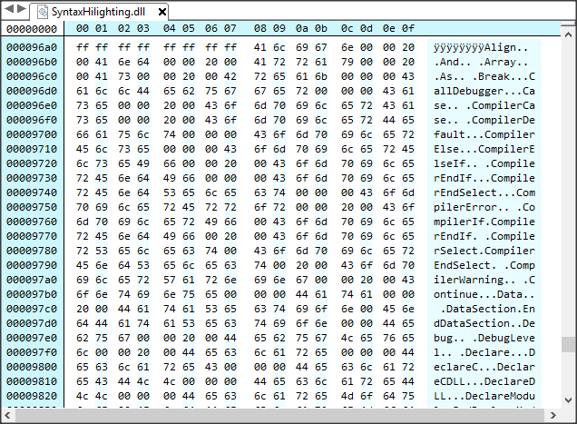
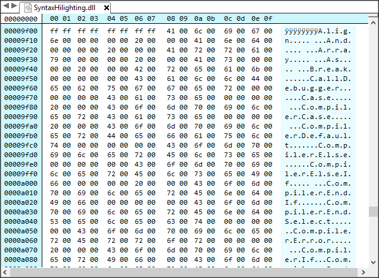

PureBASIC Tokens List
=====================

This document discusses the PureBASIC language tokens list in relation to syntax highlighters and code editors lang definitions: were to find the tokens list, how to manage and update it with different releases of the language, etc.

------------------------------------------------------------------------

<!-- #toc -->
-   [Introduction](#introduction)
-   [Terminology](#terminology)
    -   [Syntax Examples](#syntax-examples)
        -   [Kate Syntax Definitions](#kate-syntax-definitions)
        -   [GeSHi](#geshi)
-   [Getting The Tokens List](#getting-the-tokens-list)
    -   [Commands Index](#commands-index)
        -   [Documentation Tools And Parsers](#documentation-tools-and-parsers)
    -   [The SDK’s Syntax Highlighter](#the-sdks-syntax-highlighter)
        -   [The Syntax Highlighting DLL Parser](#the-syntax-highlighting-dll-parser)
    -   [Querying The Compiler](#querying-the-compiler)
-   [Accessing Resources Within The Installer](#accessing-resources-within-the-installer)

<!-- /toc -->

------------------------------------------------------------------------

Introduction
============

Creation and maintainance of PureBASIC language syntax definitons will require having access to the full list of the language’s tokens. Unfortunately the task at hand is not that simple: PureBASIC doesn’t provide a list these tokens in a usable format. Furthermore, maintaining a tokens list of this kind will require to track changes with each new release of the language (new toknes, renaming, and deprecation).

Terminology
===========

To avoid confusion, we’ll refer here to all PureBASIC built-in reserved keyword as “*tokens*”. This allows us to better classify the actual tokens into groups since most code beatifiers and editors will require that tokens are grouped into meaningful categories. The actual group names and subdivisions may vary amongst different applications, so we should look at some usage examples and try to subdvide tokens in the higher number of groups, in order to cover the needs of all potential applications (merging multiple groups into a single one, for apps that require less categories, is an easy task).

Syntax Examples
---------------

So, let’s look at the tokens grouping conventions used by some syntax highlighters (beautifiers and editors alike), so that we can create a list of categories that would satisfy exporting tokens to any application.

### Kate Syntax Definitions

[Kate](https://kate-editor.org/)’s (KDE Advanced Text Editor) syntax definitions are also used by various syntax highlighters.

For example, **pandoc** ([&gt;=1.19.2](https://github.com/jgm/pandoc/releases/tag/1.19.2)) uses [skylighting](https://github.com/jgm/skylighting) for syntax highlighting, which relies on Kate definitions, and ships with a [PureBASIC syntax definition](https://github.com/jgm/skylighting/blob/master/xml/purebasic.xml).

The Kate Syntax Definitions XML schema (`<!DOCTYPE language SYSTEM "language.dtd">`) can be found at:

-   <https://github.com/KDE/syntax-highlighting/blob/master/data/schema/language.xsd>

These are tokens groups used in the [PureBASIC syntax definition](https://github.com/KDE/syntax-highlighting/blob/master/data/syntax/purebasic.xml) (ASM not supported):

| TOKENS GROUP  | DESCRIPTION         | EXAMPLES                          |
|---------------|---------------------|-----------------------------------|
| **keywords**  | Basic Keywords      | `If`, `for`, `Procedure`, `Break` |
| **compiler**  | Compiler directives | `CompilerIf`, `CompilerSelect`    |
| **debug**     | Debugger directives | `Debug`, `CallDebugger`           |
| **functions** | Built-in commands   | `Abs`, `MessageRequester`         |

### GeSHi

[GeSHi](http://qbnz.com/highlighter/) (Generic Syntax Highlighter for PHP) 1.0 ships with a [PureBASIC syntax definition](https://github.com/GeSHi/geshi-1.0/blob/master/src/geshi/purebasic.php).

Instead of named groups, GeSHi adopts numbered arrays to group tokens:

| TOKENS GROUP | DESCRIPTION             | EXAMPLES                                         |
|--------------|-------------------------|--------------------------------------------------|
| **group 1**  | Keywords                | `If`, `for`, `Procedure`, `CompilerIf`, `Debug`, |
| **group 2**  | All Functions           | `Abs`, `MessageRequester`                        |
| **group 3**  | ASM instructions (some) | `AAA`, `JNZ`, `RET`                              |

Unlike Kate’s definition, GeSHi’s definition doesn’t subgroup compiler and debugger directives — in this case, the members of these groups could be just merged into group 1.

> **NOTE**: Keywords group 2 also contains functions from third party libraries, like `egrid_AddColumn` and all the other functions added by the **egrid** library by srod (see [PB Forum \#23769)](http://www.purebasic.fr/english/viewtopic.php?t=23769).

Getting The Tokens List
=======================

The possible sources for these tokens are:

1.  [The documentation’s Commands Index page](#commands-index),
2.  [The SDK’s syntax highlighter shared library](#the-sdks-syntax-highlighter),
3.  [Querying the compiler via interactive command](#querying-the-compiler).

Commands Index
--------------

The [Commands Index](http://www.purebasic.com/documentation/) page in the documentation — available both online (latest version only) as well as in PureBASIC installation — is an html document containing the list of all the command supported by any given version of PureBASIC, including commands that are OS specific.

The online version of the documentation is available only for the latest release of PureBASIC, therefore in order to build a version-annoted list of commands older versions of this file need to be accessed from the documentation that ships with each PureBASIC installation ([or directly from the installer](#accessing-resources-within-the-installer), as we shall see).

On Windows, the html page is found inside the CHM Help file (`PureBasic.chm`) that is part of the installation, so it needs to be extracted (CHM files can be unpacked like a ZIP file), as shown in **@Marc56us** code (below).

On Mac, the documentation ships as loose html files, so no unpacking is required. On Linux the documentation is not in html.

### Documentation Tools And Parsers

User [**@Marc56us**](http://www.purebasic.fr/english/memberlist.php?mode=viewprofile&u=11155) has created useful code bases for extracting the list of commands and constants from the online [Commands Index](http://www.purebasic.com/documentation/reference/commandindex.html) and [PureBasic Constants](http://www.purebasic.com/documentation/reference/pbconstants.html) documentation pages:

-   [`Commands-Index-Parser.pb`](./Commands-Index-Parser.pb) — extract list of commands from online documentation.
-   [`PB-Keywords-Lister.pb`](./PB-Keywords-Lister.pb) — extract and save to file list of commands and constants from online documentation.

He also provided some code to extract the “`commandindex.html`” page/file from “`PureBasic.chm`”, which is a very handy way to access the Commands Index page of previous versions:

-   [`Extract-Commands-Index-from-CHM.pb`](./Extract-Commands-Index-from-CHM.pb)

These code examples can be easily adapted to become part of a tokens extractor application.

The SDK’s Syntax Highlighter
----------------------------

PureBASIC for Windows comes with a syntax highlighter library in the SDK:

-   `\SDK\Syntax Highlighting\SyntaxHilighting.dll`

> (*sic*): the DLL file is actually (mis)named `SyntaxHilighting.dll`, not a typo on my side.

The DLL contains the keywords list of the language version it ships with. So (theoretically) it should be an up-to-date list reflecting the state of the syntax of any given version. I said “theoretically” because the SDK is in a pretty bad state, its documentation still refers to the Amiga in some places, and some sources therin are broken because they haven’t been updated for ages (see [PB Forum \#66969](http://www.purebasic.fr/english/viewtopic.php?f=3&t=66969)).

Since the DLL is in binary format, you’ll need and hex editor to peek inside it, and then work out a way of extracting the list. Also, the strings from version 5.50 onward are in Unicode format (UCS2 LE), before that they are in Ascii — any automated approach to extracting the strings must bare this in mind.

This is a screenshot of the contents of the `SyntaxHilighting.dll` that ships with PureBASIC 5.43, from [Hex Editor Neo](https://www.hhdsoftware.com/hex-editor):

And this is a screenshot of `SyntaxHilighting.dll` that ships with PureBASIC 5.50:

… you can clearly see the difference between the Ascii and Unicode strings.

### The Syntax Highlighting DLL Parser

-   [`Parse-Highlighting-DLL.pb`](./Parse-Highlighting-DLL.pb)

This app parses the `SyntaxHilighting.dll` and extract the list of keywords it contains, and saves them to a text file. The final list will contain three lists of keywords (in this order, and no separation between them):

1.  PureBASIC pseudotypes,
2.  PureBASIC keywords,
3.  ASM keywords.

Any PureBASIC user should be able to easily distinguish when one list ends and the next one begins by his knowledge of the keywords — ie: PureBASIC keywords are title-cased, while ASM keywords are all upper-case — and by the fact that the alphabetical ordering starts over again with each new list.

> **NOTE**: The final list will contain some duplicate keywords and a couple of non-strictly keywords strings (ie: `P` and `ABCUWLSFDQI`, the former relating to accessing procedures variables from inline Assembly, the latter being the list of characters used for native types).
>
> Keywords duplicates are due to the fact that the Syntax Highlighting DLL tracks coupled tokens (eg: `If`, `EndIf`) by following an opening kewyord with its closing counterpart (presumably, for autocompletion purposes within the IDE). Also, some keywords share a common closing counterpart (eg: blocks declared with `Procedure`, `ProcedureC`, `ProcedureCDLL` and `ProcedureDLL` are all ended with `EndProcedure`, so the token `EndProcedure` will occur 5 times in the list).
>
> This type of redundancy is commonly found in language definitions for code editors, but it’s usually undesirable in code beautifiers.

The purpose of this tool is *not* to create a ready-to-use list of tokens: the purpose is to pass the lists to some diffing tool in order to see what has changed between different PureBASIC releases. This provides a quick way to see whether tokens have been added or removed since the previous PureBASIC release, allowing maintainers of language definitions to manually adjust their lists, or the automate the task via merge tools.

Here’s an example screenshot of a [Beyond Compare](http://www.scootersoftware.com/) merging sessions that diffs two tokens-lists (PB 5.00 & 5.10) extracted with `Parse-Highlighting-DLL.pb`:

> **NOTE**: Bare in mind that the tokens list will not contain the built-in commands: PureBASIC IDE highlights user-created procedures and built-in functions in the same manner. For a full list of the built-in commands, refer to the [Commands Index](#commands-index) section of this document.

Querying The Compiler
---------------------

PureBASIC’s command line compiler can be invoked with the `/STANDBY` switch (`--standby` on Linux/Mac): this will start an interactive I/O session where special commands can be passed to the compiler. Among the commands that can be imparted in this special mode, there are some tha will query the compiler to output a list of *its known* functions, imported functions, interfaces, structures, and constants. These features are well documentent in the SDK’s `CompilerInterface.txt` file.

The problem with this approach is that the compiler will only produce a list of the features it supports, therefore platform-dependent functions will not be supported by the compiler of another platform — ie: the compiler will only produce a list of *its known* functions, interfaces, etc.

User **@Danilo** has written `GetPBInfo.pb`, an app the gets information about PureBASIC structures, interfaces, constants and functions directly from the compiler and saves the information to files:

-   [GetPBInfo thread on PureBASIC Forum](http://purebasic.fr/english/viewtopic.php?f=12&t=53701)

If you try to run it on Windows, you’ll notice that the output list will not contain the procedures `CocoaMessage()` (Mac only) and `SvgVectorOutput()` (Linux only).

Therefore this method can’t be used to produce a full list of the PureBASIC language tokens. This limitation might not be a problem if you are working on a language definition for a platform-specific code editor, but it surely becomes a problem when targetting cross-platform applications.

Accessing Resources Within The Installer
========================================

To avoid having to install each version of PureBASIC in order to access the above mentioned resources, the only workaround is to extract the contents of the binary installers, without actually installing anything.

The Linux installer is just a GZIP Compressed Tar Archive file (`*.tgz`), so you can unpack it with 7-Zip.

The Mac installer comes as an Apple Disk Image file (`*.dmg`), and it can be unpacked using 7-Zip too.

-   [www.7-Zip.org](http://www.7-zip.org/)

The Windows installer is a binary installer created with [Inno Setup](http://www.jrsoftware.org/isinfo.php) and it can’t be unpacked with ordinary compression tools like WinZip, 7-Zip and WinRAR.

You’ll need a free tool called **Universal Extractor**, an unpacker that supports a variaty of compression and isntaller formats, included the one used by the PureBASIC installer:

-   <https://www.legroom.net/software/uniextract>

