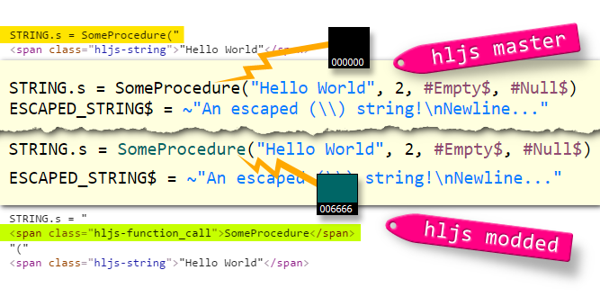

HLJS PureBASIC Mod Prebuilt
===========================

This folder contains pre-built highlight.js packages, with the modded PureBASIC syntax version.

I’ve created different prebuilt HJS packages, each including a different combinations of languages, which should cover the most common scenarios for documentation related to PureBASIC developement.

Pre-built packages are divided into folders, each folder contains the `highlight.pack.js`, the CSS file for the included languages, and an example file.

------------------------------------------------------------------------

<!-- #toc -->
-   [Related Links](#related-links)
-   [Difference from Official HLJS](#difference-from-official-hljs)
-   [The Language Packages](#the-language-packages)
    -   [CSS Files](#css-files)
        -   [Langs Themes](#langs-themes)
        -   [Implemented Langs Themes](#implemented-langs-themes)
-   [Acknowledgments and Credits](#acknowledgments-and-credits)

<!-- /toc -->

------------------------------------------------------------------------

Related Links
=============

-   [PureBASIC Forums announcement](http://www.purebasic.fr/english/viewtopic.php?f=14&t=65430)
-   [«PureBASIC Archives» highlighters section](https://github.com/tajmone/purebasic-archives/tree/master/syntax-highlighting)

Difference from Official HLJS
=============================

Reagrding **highlight.js**, the `PureBASIC` branch differs from the official HLJS release by the way it parses PureBASIC source code.

The modded version tags PureBASIC procedure calls (as `function_call`), thus mimicking 100% the native PB IDE. This `function_call` tag isn’t reckognized by the official HLJS release, and was removed from my original submission of PB lang definition. Which means that official releases of **highlight.js** won’t mimick 100% the native PB IDE.

So I’ve decided to maintain a PureBASIC fork of my own, implementing the `function_call` tag in PureBASIC syntax.

Here is a screenshot of the visual difference between the two, along with a peek at their difference in the final html code:

The Language Packages
=====================

There are 4 different pre-built HJS packages, with PureBASIC (modded) syntax being the central language in all of them:

-   [`/hljs-pb-only/`](./hljs-pb-only/) — Just PureBASIC syntax.

-   [`/hljs-pb-dev1/`](./hljs-pb-dev1/) — PureBASIC + Bash + DOS + Ini + PowerShell + FASM.

-   [`/hljs-pb-dev1/`](./hljs-pb-dev1/) — PureBASIC + Bash + DOS + Ini + PowerShell + FASM + Diff + Makefile + JSON.

-   [`/hljs-all/`](./hljs-all/) — All languages available in current HJS release.

These choices were arbitrary, and suggestions are welcome. I would like to maintain pre-built packages based on common use scenarios, as an alternative to the extreems of `/hljs-pb-only/` and `/hljs-all/` – which is rather big: more than 160 langs!.

`/hljs-pb-dev1/` is meant as a bare minimum combination of languages for cross-platform PureBASIC documentation — basic Linux Shell and Windows CMD related scripts or configuration files should be included.

`/hljs-pb-dev2/` is intended as a more complete set of choices for cross-platform PureBASIC developers documentation. It will always contain all of `/hljs-pb-dev1/`‘s langs, plus more advanced syntaxes used in expert developement – Diff, Makefile, JSON, and other standards which are either part of PureBASIC’s advanced usage, or part of common developers’ tools (VCS, C compiling, ecc.)

These are not easy choices: each person has his own view of what a developement environment should be. Therefore, if you’d like to see a language added to these (or a new) pre-built packages, just ask for it. Having 4 or 5 extra unused language definition packed in `highlight.pack.js` won’t be a burdern on the browser – always better than going for the `/hljs-all/` package, with its 160+ language definitions, most of which have no bearing whatsoever on PureBASIC.

CSS Files
---------

With each package also comes a `highlight.css` stylesheet, taylored to go hand-in-hand with the pre-built HLJS package in the same folder, and covering CSS definition for the same langs included in the package.

### Langs Themes

My long term intention is to provide a custom CSS definition for each language syntax included in the prebuilt HLJS package, so that each language is presented with a different color theme within the same document, allowing the reader to distinguish code block by their style.

Wherever possible, themes will mimick the language native’s IDE colors — like I did with PureBASIC’s theme. When a language has no official native IDE theme to be associated with, I’ll resort to either a popular style associated with it (from its online documentation, or some IDE strongly associated with that lang) or just create a custom theme to distinguish it from other langs.

### Implemented Langs Themes

Presently, I’ve defined CSS subsets only for PureBASIC and a few other langs:

-   **PureBASIC** — mimicks PB’s native IDE default color scheme.
-   **Bash** — using xterm default palette.
-   **Diff** — loosely inspired on [GitHub Compare View](https://github.com/blog/612-introducing-github-compare-view) color scheme.
-   **FASM** — using xterm default palette, soon to be changed.

All languages without a specific CSS definition will fallback on the general HLJS CSS theme which I’ve added to the prebuilt packages: `monokai-sublime.css`, from HLJS themes folder.

From time to time I’ll be adding more CSS lang themes.

Acknowledgments and Credits
===========================

Due credits and thanks go to:

-   **Jordan Klassen** [@forivall](https://github.com/forivall) – for his [`gh-pandoc.css`](https://gist.github.com/forivall/7d5a304a8c3c809f0ba96884a7cf9d7e) stylesheet ([MIT License](https://gist.github.com/forivall/7d5a304a8c3c809f0ba96884a7cf9d7e#file-license-md)), which I’m using here (modified version).
-   **Jakub Pawlowicz** [@jakubpawlowicz](https://github.com/jakubpawlowicz) – creator of [**clean-css**](https://www.npmjs.com/package/clean-css) (Node.js) CSS minifier ([MIT License](https://github.com/jakubpawlowicz/clean-css/blob/master/LICENSE)), which I’m using in my HLJS pre-building toolchain.
-   **Kyo Nagashima** [@hail2u](https://github.com/hail2u) – creator of [**gfmtoc**](https://github.com/hail2u/node-gfmtoc) (Node.js) GitHub flavored Markdown TOC generator ([MIT License](https://hail2u.mit-license.org/2014)), which I’m using to update the markdown files of this branch.
-   **John MacFarlane** [@jgm](https://github.com/jgm) – creator of [**Pandoc**](http://pandoc.org/) universal document converter ([GPL2+ License](https://github.com/jgm/pandoc/blob/master/COPYRIGHT)), which I’m using to cleanup and convert the markdown files of this branch.

